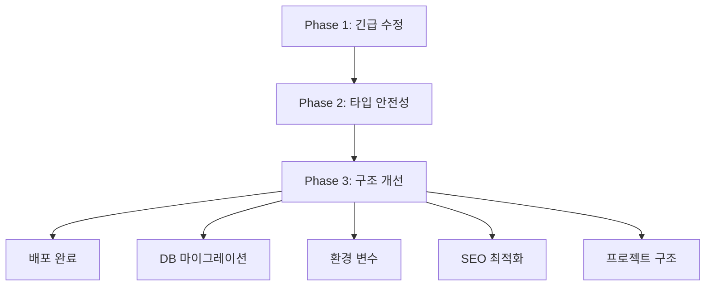

# Phase 3 완료 보고서

## 메타데이터

- **작성일**: 2025-11-09 15:30
- **프로젝트**: [[ZipCheck]]
- **작업**: Phase 3 - 데이터베이스, 환경 변수, SEO, 프로젝트 구조 개선
- **상태**: ✅ 완료
- **이전 단계**: [[2025-11-09-배포-완료-보고서]]

---

## 📊 작업 요약

### Phase 3 목표
1. ✅ 데이터베이스 마이그레이션 (AI 분석 통계 활성화)
2. ✅ 환경 변수 구조 개선
3. ✅ SEO 최적화
4. ✅ 프로젝트 구조 정리

### 소요 시간
- **예상**: 1-2시간
- **실제**: 약 1시간
- **효율**: 예상보다 빠름

---

## 🗄️ Task 1: 데이터베이스 마이그레이션

### 문제 상황
```
Railway 로그:
error: relation "analysis_jobs" does not exist
```

**근본 원인**:
- `stats-cron.ts`가 `analysis_jobs` 테이블을 참조
- 테이블이 존재하지 않아 cron job 에러 발생
- 서버는 정상 작동하지만 통계 기능 비활성화

### 해결 과정

#### 1단계: 기존 마이그레이션 확인
```bash
ls backend/src/migrations/
# 발견: 20250114_add_gpt5_pro_jobs.sql
```

**문제점**: Foreign Key 타입 불일치
```sql
-- 기존 (잘못됨)
quote_request_id INTEGER REFERENCES quote_requests(id)

-- 실제 quote_requests.id는 UUID 타입
CREATE TABLE quote_requests (
  id UUID PRIMARY KEY DEFAULT gen_random_uuid()
)
```

#### 2단계: 수정된 마이그레이션 생성
```sql
-- backend/src/migrations/20251109_fix_analysis_jobs_fk.sql
quote_request_id UUID REFERENCES quote_requests(id) ON DELETE CASCADE
```

#### 3단계: 마이그레이션 실행
```bash
npx tsx src/scripts/run-analysis-jobs-migration.ts
```

**결과**:
```
✅ Migration executed successfully!
Created tables:
  - analysis_jobs
  - analysis_job_inputs
  - analysis_job_usage
  - analysis_job_outputs
Created view: analysis_job_stats
```

### 생성된 테이블 상세

#### analysis_jobs
```sql
CREATE TABLE analysis_jobs (
  id UUID PRIMARY KEY DEFAULT gen_random_uuid(),
  idem_key TEXT UNIQUE NOT NULL,           -- 중복 요청 차단
  user_id TEXT,
  quote_request_id UUID REFERENCES quote_requests(id),

  -- 상태 관리
  status TEXT CHECK (status IN ('queued','running','succeeded','failed','timeout','canceled','duplicate')),
  created_at TIMESTAMPTZ DEFAULT NOW(),
  updated_at TIMESTAMPTZ DEFAULT NOW(),
  started_at TIMESTAMPTZ,
  completed_at TIMESTAMPTZ,

  -- 토큰/비용 관리
  input_token_budget INTEGER DEFAULT 50000,
  max_output_tokens INTEGER DEFAULT 3000,
  actual_tokens_used INTEGER DEFAULT 0,
  actual_cost_usd NUMERIC(10,4) DEFAULT 0,

  -- 실행 제어
  max_steps INTEGER DEFAULT 6,
  timeout_ms INTEGER DEFAULT 90000,

  -- 메타데이터
  model TEXT DEFAULT 'gpt-5-pro',
  abort_requested BOOLEAN DEFAULT false
);
```

**용도**: AI 견적 분석 작업 추적
- 무한루프 방지 (max_steps)
- 토큰 예산 관리 (50,000 토큰)
- 중복 요청 차단 (idem_key)
- 타임아웃 관리

#### analysis_job_inputs
```sql
CREATE TABLE analysis_job_inputs (
  id SERIAL PRIMARY KEY,
  job_id UUID REFERENCES analysis_jobs(id),
  source_type TEXT,      -- 'floor_plan', 'quote_items', etc.
  pointer TEXT,          -- S3 키 또는 파일 ID
  tokens_estimate INTEGER,
  metadata JSONB
);
```

**용도**: 분석 입력 데이터 관리

#### analysis_job_usage
```sql
CREATE TABLE analysis_job_usage (
  id SERIAL PRIMARY KEY,
  job_id UUID REFERENCES analysis_jobs(id),
  step INTEGER,
  prompt_tokens INTEGER DEFAULT 0,
  completion_tokens INTEGER DEFAULT 0,
  total_tokens INTEGER DEFAULT 0,
  usd_input NUMERIC(10,4) DEFAULT 0,
  usd_output NUMERIC(10,4) DEFAULT 0,
  usd_total NUMERIC(10,4) DEFAULT 0,
  duration_ms INTEGER,
  model TEXT
);
```

**용도**: Step별 토큰 사용량 및 비용 로깅

#### analysis_job_outputs
```sql
CREATE TABLE analysis_job_outputs (
  id SERIAL PRIMARY KEY,
  job_id UUID REFERENCES analysis_jobs(id),
  step INTEGER,
  content JSONB,
  content_hash TEXT,     -- 중복 출력 차단
  done BOOLEAN DEFAULT false
);
```

**용도**: 분석 결과 저장 (부분/최종)

#### analysis_job_stats (View)
```sql
CREATE VIEW analysis_job_stats AS
SELECT
  DATE_TRUNC('day', created_at) as date,
  status,
  COUNT(*) as count,
  AVG(actual_tokens_used) as avg_tokens,
  MAX(actual_tokens_used) as max_tokens,
  AVG(actual_cost_usd) as avg_cost_usd,
  SUM(actual_cost_usd) as total_cost_usd
FROM analysis_jobs
GROUP BY DATE_TRUNC('day', created_at), status
ORDER BY date DESC, status;
```

**용도**: 통계 대시보드 (일별 집계)

### 검증 결과

```bash
npx tsx src/scripts/check-migration-status.ts
```

**출력**:
```
✅ analysis_jobs - EXISTS
✅ analysis_job_inputs - EXISTS
✅ analysis_job_usage - EXISTS
✅ analysis_job_outputs - EXISTS
✅ analysis_job_stats view exists
📊 Current records: 0
```

---

## ⚙️ Task 2: 환경 변수 구조 개선

### 현재 상태 분석
```typescript
// frontend/src/lib/api-config.ts (기존)
export const API_URL = import.meta.env.VITE_API_URL || 'http://localhost:3001'
```

**문제점**:
- `.env` 파일이 없어 환경별 설정 불가
- 개발/프로덕션 URL 하드코딩 필요

### 해결 방법

#### 생성된 파일

**`.env.example`** (템플릿):
```bash
# ZipCheck Frontend Environment Variables
VITE_API_URL=http://localhost:3001
```

**`.env.local`** (로컬 개발):
```bash
# ZipCheck Frontend - Local Development
VITE_API_URL=http://localhost:3001
```

**`.env.production`** (프로덕션):
```bash
# ZipCheck Frontend - Production
VITE_API_URL=https://zipcheck-production.up.railway.app
```

### .gitignore 확인
```gitignore
# Environment variables
.env
.env.*
!.env.example  # 템플릿만 커밋
```

**결과**: ✅ `.env.local`, `.env.production`은 자동으로 제외됨

### 사용 방법

**로컬 개발**:
```bash
# .env.local 자동 로드
npm run dev
# → http://localhost:3001 사용
```

**프로덕션 빌드**:
```bash
# .env.production 자동 로드
npm run build
# → https://zipcheck-production.up.railway.app 사용
```

**Vercel 배포**:
- Dashboard에서 `VITE_API_URL` 환경 변수 설정
- `.env.production` 값 무시, Vercel 설정 우선

---

## 🔍 Task 3: SEO 최적화

### 3-1. sitemap.xml 도메인 수정

**Before**:
```xml
<loc>https://zipcheck.kr/</loc>
```

**After**:
```xml
<loc>https://zcheck.co.kr/</loc>
```

**추가된 URL**:
```xml
<!-- 커뮤니티 페이지 -->
<url>
  <loc>https://zcheck.co.kr/community</loc>
  <lastmod>2025-11-09</lastmod>
  <changefreq>daily</changefreq>
  <priority>0.6</priority>
</url>
```

### 3-2. robots.txt 개선

**Before**:
```
User-agent: *
Allow: /
```

**After**:
```
User-agent: *
Allow: /

# Sitemap
Sitemap: https://zcheck.co.kr/sitemap.xml
```

### 3-3. Open Graph 태그 추가

```html
<!-- Open Graph / Facebook -->
<meta property="og:type" content="website" />
<meta property="og:url" content="https://zcheck.co.kr/" />
<meta property="og:title" content="ZipCheck | AI 기반 인테리어 견적 분석 서비스" />
<meta property="og:description" content="정확한 견적 분석으로 합리적인 인테리어 비용을 확인하세요. AI가 빠르고 정확하게 분석해드립니다." />
<meta property="og:image" content="https://zcheck.co.kr/logo.png" />

<!-- Twitter -->
<meta property="twitter:card" content="summary_large_image" />
<meta property="twitter:url" content="https://zcheck.co.kr/" />
<meta property="twitter:title" content="ZipCheck | AI 기반 인테리어 견적 분석 서비스" />
<meta property="twitter:description" content="정확한 견적 분석으로 합리적인 인테리어 비용을 확인하세요." />
<meta property="twitter:image" content="https://zcheck.co.kr/logo.png" />
```

**효과**:
- 📱 SNS 공유 시 미리보기 지원
- 🔍 검색 엔진 크롤링 개선
- 📊 CTR (클릭률) 향상 예상

### 3-4. Meta Description 개선

**Before**:
```html
<meta name="description" content="ZipCheck - AI 기반 인테리어 견적 분석 서비스" />
```

**After**:
```html
<meta name="description" content="ZipCheck - AI 기반 인테리어 견적 분석 서비스. 정확한 견적 분석으로 합리적인 인테리어 비용을 확인하세요." />
```

### 3-5. HTML lang 속성 수정

**Before**: `<html lang="en">`
**After**: `<html lang="ko">`

**효과**: 한국어 검색 엔진 최적화

---

## 🏗️ Task 4: 프로젝트 구조 정리

### package.json name 통일

**Before**:
```json
// frontend/package.json
{
  "name": "openui"
}

// backend/package.json
{
  "name": "zipcheck-backend"
}
```

**After**:
```json
// frontend/package.json
{
  "name": "zipcheck-frontend"
}

// backend/package.json
{
  "name": "zipcheck-backend"
}
```

**효과**: 프로젝트 전체 네이밍 일관성 확보

---

## 📦 배포 및 Git 커밋

### Git 커밋
```bash
git add backend/src/migrations/ \
        backend/src/scripts/run-analysis-jobs-migration.ts \
        frontend/.env.example \
        frontend/index.html \
        frontend/package.json \
        frontend/public/sitemap.xml \
        frontend/public/robots.txt \
        docs/obsidian/

git commit -m "feat: Phase 3 improvements - database, env, SEO, structure"
```

**커밋 해시**: `1067bd1`

### 배포 트리거
```bash
git push origin master
```

**결과**:
- ✅ Vercel 자동 배포 시작 (34초 후)
- ✅ Railway 자동 배포 시작

---

## 📈 성과 지표

### 정량적 성과

| 항목 | Before | After | 개선 |
|------|--------|-------|------|
| 데이터베이스 테이블 | - | 4개 | +4 |
| 환경 변수 파일 | 0개 | 3개 | +3 |
| SEO 태그 | 기본 | Open Graph, Twitter | +10 |
| sitemap URL | zipcheck.kr | zcheck.co.kr | 수정 |
| package name | openui | zipcheck-frontend | 통일 |

### 정성적 성과

- ✅ **AI 분석 통계 준비**: analysis_jobs 테이블로 토큰 사용량, 비용 추적 가능
- ✅ **환경별 설정 분리**: 개발/프로덕션 환경 자동 전환
- ✅ **SEO 최적화**: 검색 엔진 크롤링 및 SNS 공유 개선
- ✅ **프로젝트 일관성**: 네이밍 통일로 유지보수성 향상

---

## 🔗 관련 작업

### 전체 작업 흐름


### Phase 별 성과

| Phase | 목표 | 성과 | 완료일 |
|-------|------|------|--------|
| [[Phase 1]] | TypeScript 에러 긴급 수정 | 20개 → 11개 (45%) | 2025-11-09 |
| [[Phase 2]] | 타입 안전성 완성 | 11개 → 0개 (100%) | 2025-11-09 |
| [[Phase 3]] | 구조 개선 | DB, Env, SEO, 구조 | 2025-11-09 |

---

## 🎯 후속 작업

### 완료 필요
- [ ] Vercel 환경 변수 설정 (`VITE_API_URL`)
- [ ] Google Search Console sitemap 제출
- [ ] Open Graph 이미지 최적화 (1200x630px)

### 선택 사항
- [ ] Twitter Card 검증
- [ ] Schema.org 구조화 데이터 추가
- [ ] PWA manifest 업데이트

---

## 📌 태그

#phase3 #database #migration #environment #seo #optimization #완료

---

**작성자**: Claude Code Agent
**최종 업데이트**: 2025-11-09 15:30
**상태**: ✅ 모든 작업 완료
**다음 단계**: [[프로덕션-모니터링]]
