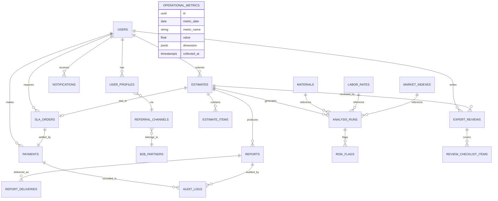

# 집첵 서비스 설계 개요

## 1. 서비스 개요
- 목�: AI와 전문가� 하�브리드 분�으로 �테리어 견�� 불확실성과 정보 비대칭� 해소하고, 투명한 가격·위험 �사�트를 제공한다.
- 핵심 가치
  - AI 시�화(그�프·차트)는 �� �성, 전문가는 항목 코멘트와 주�사항� 집중
  - 업계 20년 �� 경력� 지닌 전문가가 유통 가격 ��터를 근거로 항목별 코멘트를 제공
  - ��터 기반 AI 견� 등급 �가(위험/�균/프리미엄 3단계, 신호등 시�화)
  - 현� 전문가� 정성 리뷰(��·공정·계약·협� ��트 등 8~10개 항목)
  - SLA 기반 리�트 딜리버리로 신뢰성 확보(Standard/Express/Urgent/Late-Night/Holiday)
- 목표 사용�: 30~40대 아파트 거주�, �사/리모�� 예정 고�, 제휴 채� 유� B2B2C 고�.

## 2. 사용� � 전문가 여정

### 2.1 사용� �르소나
- **김�테리어(36세)**: 첫 아파트 구매, 야간� 견� 비�로 불안� 해소 필요, 전문 �견 �존�가 높다.
- **제휴 유� 고�**: 부�산·�사 플���서 제공하는 ��/쿠�으로 집첵 체험, SLA 기반 빠른 분� 기대.

### 2.2 핵심 여정
1. 온보딩 � 본� �� → 주거 형태·�형·공사 범위 �력
2. Select space type (residential or commercial), upload the estimate file, choose an SLA plan, and complete payment.
3. 진행 현황 대시보드�서 SLA 카운트다운·�태 확�
4. 하�브리드 리�트 열�: AI 등급 카드, 위험 플�그, 전문가 코멘트, 협� 가�드
5. PDF 다운로드/공유 → 후기 �성 �는 ��뢰

### 2.3 전문가 콘솔 �름
1. SLA Priority Queue 기반으로 티켓 �� 할당
2. AI 초안 검토: 항목별 �균 대비 �차, 위험 �지 결과 확�
3. 정성 코멘트·협� ��트 �력, 위험 플�그 보강
4. QA 담당� 승� → 리�트 확정 → SLA 준수 모니터

### 2.4 KPI
- 업로드→결제 전환율, SLA 준수율, 리�트 열�률, 고� ��뢰·추천율
- 전문가 처리 시간, QA 리오픈율, 위험 플�그 정합성
- 제휴 채�별 전환율, ARPU, SLA별 수� 비중

### 2.5 전문가 운� 정책
- 전문가 풀� 관리�(운�팀)가 �접 선발·등�하며, 외부�서 �유 가�� 허용하지 않는다.
- 전문가는 �테리어 업계 20년 �� 경력� 가진 시공/견� 베테�으로 구성�며, 유통 가격 ��터를 기반으로 코멘트를 �성한다.
- 관리� �털�서 전문가� 투� 현황과 SLA 진행 �황만 모니터�하며, 현� 단계�서는 �� �가나 ��티 제�를 ��하지 않는다.

## 3. ��터 모� 개요

| �메� | 주요 엔터티 | 핵심 �성 |
| --- | --- | --- |
| 사용� | `users`, `user_profiles` | 역할(role), 연�처, �르소나 태그, 제휴 채� |
| 견� | `estimates` | 업로드 사용�, SLA 주문, 공사 범위, �태, �본 파� |
| 견� 항목 | `estimate_items` | 카테고리(��/공정/�건비/디�� 등), 수량, 단가, �본 �� |
| AI 분� | `analysis_runs`, `risk_flags`, `analysis_metrics` | 모� 버전, �균 대비 �차, 위험 �수·설명 |
| 전문가 리뷰 | `expert_reviews`, `review_checklist` | 종합 �견, 협� ��트, 계약 주�사항, QA �태 |
| SLA/결제 | `sla_orders`, `payments`, `invoices` | 티어, 약� 시간, 처리 시간, 금액, 결제 �수� |
| 알림/리�트 | `notifications`, `report_deliveries`, `reports` | 발송 채�, 웹 뷰 URL, PDF 경로, 다운로드 로그 |
| 시� ��터 | `materials`, `labor_rates`, `market_indexes` | 지역별 단가, 변� 추�, 공급� 정보 |
| 마케팅/제휴 | `content_posts`, `trend_reports`, `b2b_partners`, `referral_channels` | 콘�츠 유형, 리�트 범주, 제휴 조건 |
| 운� 지표 | `operational_metrics` | SLA 준수율, ��화율, 처리 시간, 고� 만족� |

## 4. API � 모듈 구조

### 4.1 REST API 요약
- **Auth**: `POST /auth/login`, `POST /auth/verify-otp`, `POST /auth/refresh`
- **Estimates**: `POST /estimates`(업로드+S3 사전 서명), `GET /estimates/{id}`, `GET /estimates/{id}/analysis`
- **Expert Review**: `POST /estimates/{id}/expert-review`, `PATCH /estimates/{id}/expert-review`
- **SLA & Billing**: `POST /sla-orders`, `POST /payments/confirm`, `GET /sla-orders/{id}/timeline`
- **Reports**: `GET /reports/{id}`, `GET /reports/{id}/download`, `POST /notifications/send`
- **Data Services**: `GET /materials`, `GET /labor-rates`, `GET /analytics/operations`, `GET /trend-reports`

### 4.2 서비스 모듈
- **Ingestion Service**: 파� 업로드, SLA 분류, �업 � 등�
- **AI Worker**: OCR→파싱→등급화→위험 �지 파�프��
- **Expert Service**: 전문가 할당, 리뷰 �력, QA 워�플로우
- **Report Composer**: 템플릿 렌��(PDF/웹), 버전 관리
- **Billing/SLA Service**: 요금 계산, 결제 게�트웨�, SLA 모니터
- **Notification Service**: 알림톡/SMS/�메� 발송, 리마��
- **Analytics Service**: SLA KPI, ��화율, B2B 리�트 ETL
- **Content & Partner Service**: 콘�츠 관리, 제휴 ��/쿠� 관리

## 5. AI 분� 파�프��
### 5.1 Space-Type Guidelines
- Analysis pipelines treat residential and commercial projects separately.
- AI baselines, risk thresholds, and expert checklists differ per space type.
- All core tables (`estimates`, `analysis_runs`, `reports`) carry a `space_type` field to keep the two pricing logics isolated.

1. **수집/전처리**: 견�서 업로드 → S3 저� → Google Vision/AWS Textract로 OCR → 항목 파싱
2. **정량 분�**: 항목 분류 모�, �형·공종별 �균 대비 �차 계산, 위험 �수 산출
3. **등급화**: 위험/�균/프리미엄 3단계 �가 � 신호등 시�화 ��터 �성
4. **정성 지�**: 전문가�게 위험 플�그, 캠 가격 그�프, 협� �트 제공
5. **리�트 합성**: AI 결과 + 전문가 코멘트 → PDF/웹 리�트
6. **피드백 루프**: 분� ��터→모� �학습, 개�화 추천, 트렌드 리�트 ��화

## 6. 시스템 아키�처 � 로드맵
### 6.1 Report Delivery Channels
### 6.2 역할 분리 �칙
- ��터 시�화(그�프, 비� 차트, 위험 �트맵)는 AI가 �� �성합니다.
- 전문가는 AI 지표를 참고해 항목 체�와 코멘트, 계약/공정 주�사항, 협� ��트 서술� 집중합니다.
- 리�트�는 "AI �성 시�화"와 "전문가 코멘트" 구역� 명확� 구분 표시합니다.

### 6.3 가격 표현 �칙
- 절대 금액 차�를 노출하지 않고, �균 대비 구간(위험/�균/프리미엄)과 �센트 범위로만 안내합니다.
- 예시 표현: "�균 가격대 대비 약 OO% 높� 수준으로, 프리미엄 ��·브�드 사용 가능성� 높습니다."
- 전문가 코멘트는 �� 품질, 디��, 공사 마� 등 추가 검�� 필요한 �역� 강조하며 유통� 가격 노출� 피합니다.

### 6.4 저가 견� 경고 � 계약금 가�드
- �균 대비 현저� 낮� 견�� �지�면 �가 산정 근거와 누� 항목� 확�하�는 경고 메시지를 표시합니다.
- �시� 계약금·중�금·�금 비율� 업계 �균(예: 10%/60%/30%)� 초과하지 않는지 체�리스트로 안내합니다.
- 공사비가 1억 � ���면서 저가 견�� �지� 경우, 건설업 면허 보유 � 보�보험 가� 여부 확�� �무화한 메시지를 노출합니다.

- SMS/카카오 알림톡/�메� 본문�는 핵심 요약(신호등 등급, 예� 절�·추가 비용, 주요 위험 Top3)만 제공한다.
- 세부 분�� PDF 리�트로 제공하며, 항목별 그�프·비�표·전문가 코멘트를 시�화한다.
- 웹 리�트는 요약 카드와 PDF 다운로드 ��를 함께 제공해 모바��서� 빠르게 확�하�� 설계한다.


### 6.1 MVP(2025~2026)
- 백엔드: NestJS(REST) + PostgreSQL + TypeORM, Redis(세션/�), AWS S3, SQS
- AI: Python(FastAPI), PyTorch/Scikit-learn, OCR SDK, Docker 기반 배치/실시간 워커
- 프런트: Next.js 사용� �털, React Admin(전문가 콘솔), Tailwind UI
- �프�: AWS ECS/Fargate �는 EKS, GitHub Actions CI/CD, CloudWatch+Grafana 모니터�
- SLA/결제: 토스��먼츠·Stripe 등 결제 게�트웨� 연�, 카카오 알림톡/SMS 발송

### 6.2 확� 단계(2026~2027)
- AI Feature Store 구축, 벡터 검색 기반 개�화 추천
- B2B 트렌드 리�트 API, API Key 발급/제휴 분� 대시보드
- 고� ��터 플��/CDP 연�, SLA 멀티리전 아키�처 준비

### 6.3 플�� 단계(2027~2028)
- 3D 시뮬레�션/시�화 서비스, 메시징·�스�로, 분� 조정 워�플로우
- 멀티테넌트 전문가/운� 콘솔, FinOps 비용 가드레�, 보안 �사 로그 강화

## 7. 후� �업 제안
1. �세 ERD(컬럼 타�, ��스)와 권한 매트릭스 �출
2. OpenAPI 스� 문서화 � BFF/프런트 계약 확정
3. AI 파�프�� PoC(샘플 견� 20건 OCR→항목 추출→�균 대비 모�)
4. SLA 결제·알림 구성(게�트웨� 선정, 카카오 알림톡 계약)
5. 전문가 운� 프로세스 매뉴얼 � QA 체�리스트 정리

## 8. �세 ERD 개요

| 테�블 | 주요 컬럼 | 설명 / ��스 |
| --- | --- | --- |
| `users` | `id (UUID PK)`, `role (enum: customer, expert, qa, admin)`, `email`, `phone`, `password_hash`, `status`, `created_at`, `updated_at` | `role`, `email`, `phone`� 유니� ��스. RBAC �용. |
| `user_profiles` | `user_id (FK users.id)`, `name`, `preferred_contact`, `persona_tag`, `referral_channel_id`, `address`, `housing_type`, `floor_area`, `marketing_opt_in` | `user_id`ì—� PK, `referral_channel_id` FK. |
| `experts` | `user_id (PK/FK)`, `certifications`, `specialty_tags`, `availability_status`, `avg_response_time` | 전문가 정보 확�, SLA �우팅�서 `availability_status` ��스. |
| `estimates` | `id (UUID PK)`, `user_id`, `sla_order_id`, `status (enum: pending, processing, ready, delivered, archived)`, `housing_type`, `floor_area`, `original_filename`, `file_url`, `uploaded_at`, `submitted_channel`, `notes` | `user_id`, `status`, `uploaded_at` 복합 ��스. 파�� S3 키 저�. |
| `estimate_items` | `id (UUID PK)`, `estimate_id`, `line_number`, `category (enum)`, `subcategory`, `description`, `quantity`, `unit`, `unit_price`, `total_price`, `source_text` | `estimate_id` ��스. ��/공정/�건비/디��/기타 카테고리. |
| `sla_orders` | `id (UUID PK)`, `user_id`, `tier (Standard/Express/Urgent/LateNight/Holiday)`, `price`, `currency`, `request_time`, `promised_time`, `completed_time`, `status (pending, paid, processing, done, cancelled)`, `payment_id`, `timezone` | `user_id`, `tier`, `status`, `promised_time` ��스. SLA 준수율 계산. |
| `payments` | `id (UUID PK)`, `user_id`, `sla_order_id`, `provider`, `provider_tx_id`, `amount`, `currency`, `status`, `paid_at`, `receipt_url` | `provider_tx_id` 유니�, `status` ��스. |
| `analysis_runs` | `id (UUID PK)`, `estimate_id`, `pipeline_stage (ocr, parsing, scoring, report)`, `model_version`, `status`, `executed_at`, `duration_ms`, `scorecard (JSONB)` | `estimate_id`, `pipeline_stage`, `executed_at` 복합 ��스. JSONB� 세부 지표 저�. |
| `risk_flags` | `id (UUID PK)`, `analysis_run_id`, `estimate_item_id`, `flag_type (missing_item, underpriced, overpriced, risk_contract, risk_schedule)`, `severity (0~100)`, `message`, `evidence (JSONB)` | `analysis_run_id`, `flag_type` ��스. |
| `expert_reviews` | `id (UUID PK)`, `estimate_id`, `reviewer_id`, `summary`, `recommendations`, `risk_summary`, `contract_notes`, `ready_for_publish`, `submitted_at`, `qa_status`, `qa_reviewer_id` | `estimate_id`, `reviewer_id`, `qa_status` ��스. |
| `review_checklist_items` | `id`, `expert_review_id`, `category`, `status (ok, attention, critical)`, `comment` | 디테� 체� ��트. |
| `reports` | `id (UUID PK)`, `estimate_id`, `version`, `title`, `summary_json`, `pdf_url`, `web_view_url`, `generated_at`, `expires_at`, `status` | `estimate_id`, `status` ��스. 버전 관리. |
| `report_deliveries` | `id`, `report_id`, `channel (web, email, kakao, sms)`, `delivered_at`, `status`, `metadata` | 발송 로그. |
| `notifications` | `id`, `user_id`, `channel`, `template_id`, `payload`, `sent_at`, `status`, `provider_message_id` | `user_id`, `channel`, `status` ��스. |
| `materials` | `id`, `name`, `category`, `supplier`, `unit`, `avg_price`, `price_index`, `region`, `effective_from`, `effective_to` | 지역·카테고리 ��스. |
| `labor_rates` | `id`, `trade`, `region`, `experience_level`, `avg_hourly_rate`, `last_updated` | 지역·�종 ��스. |
| `market_indexes` | `id`, `region`, `housing_type`, `floor_band`, `avg_total_cost`, `data_source`, `reported_at` | 시� �균 비�용. |
| `content_posts` | `id`, `slug`, `title`, `type (blog, video, case)`, `status`, `published_at`, `author_id`, `tags` | 콘�츠 마케팅 관리. |
| `trend_reports` | `id`, `title`, `region`, `period`, `download_url`, `summary`, `published_at` | B2B 리�트. |
| `b2b_partners` | `id`, `name`, `channel_type`, `contact`, `referral_code`, `terms`, `status`, `created_at` | 제휴 정보. |
| `referral_channels` | `id`, `partner_id`, `name`, `tracking_code`, `landing_url`, `status` | 사용� 유� 트�킹. |
| `operational_metrics` | `id`, `metric_date`, `metric_name`, `value`, `dimension (JSONB)`, `collected_at` | SLA, ��화율, 고� 만족� 등 집계. |
| `audit_logs` | `id`, `actor_id`, `actor_role`, `action`, `resource_type`, `resource_id`, `metadata`, `created_at` | 보안 �사, �벤트 소스. |

### 8.1 관계 요약
- `users` 1:N `estimates`, `sla_orders`, `payments`, `notifications`.
- `estimates` 1:N `estimate_items`, `analysis_runs`, `expert_reviews`, `reports`.
- `analysis_runs` 1:N `risk_flags`.
- `expert_reviews` 1:N `review_checklist_items`.
- `reports` 1:N `report_deliveries`.
- `sla_orders` 1:1 `payments`, N:1 `users`, N:1 `estimates`.
- `referral_channels` N:1 `b2b_partners`; `user_profiles.referral_channel_id`로 연결.
- `operational_metrics`는 ETL 결과로 저�하며 다른 테�블과는 논리� 연관.

### 8.2 ��스/성능 고려
- 분� 조회는 `estimate_id`를 파티션 키로 사용하여 범위 검색 최�화.
- JSONB 필드(`scorecard`, `evidence`, `summary_json`, `dimension`)�는 GIN ��스 �용.
- SLA 마� 모니터�� 위해 `sla_orders`� `promised_time` 기반 B-Tree ��스.
- �기 보관 리�트는 `reports` 테�블� 버전·만료� 기반으로 아카�빙.

### 8.3 ERD 다�어그� (Mermaid)


## 9. OpenAPI 스� 초안

### 9.1 ��
```yaml
POST /auth/login
  request:
    fields: email | phone, password | otp_request
  responses:
    200: { otp_required: boolean, session_id }
POST /auth/verify-otp
  request: { session_id, otp_code }
  responses:
    200: { access_token, refresh_token, user: { id, role, name } }
POST /auth/refresh
  request: { refresh_token }
  responses:
    200: { access_token, expires_in }
```

### 9.2 견� 업로드 � �태
```yaml
POST /estimates
  consumes: multipart/form-data
  fields:
    file: 견�서 (PDF, JPG, PNG)
    housing_type, floor_area, project_scope, sla_tier
  responses:
    201: { estimate_id, sla_order_id, upload_url?, status: "pending" }

GET /estimates/{estimateId}
  responses:
    200: {
      id, status, sla_order: {...},
      progress: { stage, percent, eta },
      customer_summary
    }

GET /estimates/{estimateId}/analysis
  responses:
    200: {
      ai_grade: { level: "risk|normal|premium", score },
      cost_comparison: [...],
      risk_flags: [{ id, type, severity, message }],
      metrics: { avg_delta, missing_items, overprice_ratio },
      last_run: { executed_at, model_version }
    }
```

### 9.3 전문가 리뷰/QA
```yaml
GET /expert/queue
  query: { tier?, status? }
  responses:
    200: [{ estimate_id, sla_tier, due_time, summary }]

POST /estimates/{estimateId}/expert-review
  request: {
    summary, recommendations, risk_summary, contract_notes,
    checklist: [{ category, status, comment }],
    visibility: "internal|customer"
  }
  responses: 201 { review_id, status: "submitted" }

PATCH /expert-reviews/{reviewId}
  request: { ready_for_publish, qa_status, qa_comment }
  responses: 200 { status }
```

### 9.4 SLA/결제
```yaml
POST /sla-orders
  request: { estimate_id, tier, payment_method, coupon_code? }
  responses:
    201: { sla_order_id, amount, currency, payment_intent_secret }

POST /payments/confirm
  request: { payment_intent_id }
  responses:
    200: { payment_id, status: "paid", receipt_url }

GET /sla-orders/{slaOrderId}/timeline
  responses:
    200: {
      tier, request_time, promised_time, completed_time,
      checkpoints: [{ stage, timestamp, actor }]
    }
```

### 9.5 리�트/알림
```yaml
GET /reports/{reportId}
  responses:
    200: {
      estimate_id, version, generated_at,
      sections: [...], download_url, share_link
    }

POST /notifications/send
  request: { user_id, channel, template_id, params }
  responses: 202 { notification_id, status: "queued" }
```

### 9.6 ��터/분�
```yaml
GET /materials
  query: { category?, region?, page?, size? }
  responses: 200: { items: [...], meta: { total, page } }

GET /analytics/operations
  query: { from, to, group_by: day|week|month }
  responses:
    200: {
      metrics: [
        { name: "sla_on_time_rate", value, dimension: { tier } },
        { name: "automation_rate", value },
        ...
      ]
    }
```

### 9.7 �러 모�
```yaml
ErrorResponse:
  status: "error"
  code: "VALIDATION_ERROR|AUTH_FAILED|NOT_FOUND|SLA_VIOLATION|PAYMENT_FAILED"
  message: string
  details?: object
```

### 9.8 ��/�가 전�
- OAuth2 password/OTP + refresh 토�, 내부 서비스 간� 서비스 계정(Client Credentials)
- 역할 기반 스코프: `customer`, `expert`, `qa`, `admin`, `system`
- 모든 API는 `x-request-id`, `x-sla-tier` 헤�로 추�, �사 로그 기�

## 10. AI 파�프�� PoC 설계

### 10.1 목표
- 샘플 견� 20~30건으로 OCR→항목 추출→�균 대비 �차 모�� 초기 성능 검�
- 위험 플�그(누�, 저가/고가 ��, 계약/공정 리스�) �지 정확� ≥70%
- 전문가 피드백 루프 설계: 모� 결과와 현업 코멘트 비�

### 10.2 ��터 세트 준비
| 유형 | 규모 | 비고 |
| --- | --- | --- |
| 실물 견� PDF | 15건 | 다양한 �형/공정, 협력사 제공 |
| �미지(JPG/PNG) | 5건 | 모바� 촬�본 �함 |
| 표준 계약서/시공 명세 | 5건 | 계약 조건 비�용 |
| 시� 단가 ��터 | �� 200종, 공정 30종 | 외부 공개 API + 협력사 견� |

#### 10.2.1 수집 �정 � 역할
- **주차 1**: 협력 시공사/견� 플��으로부터 샘플 확보, NDA·비�별 조항 체결
- **주차 2**: 모바� 촬� 견� 수집(촬� 가�드 제공), 해��/왜곡 보정
- **주차 3**: 공공��터/협력사 DB�서 ��·공정 단가 추출 � 정제
- 담당: Data Ops 1명(수집·정제), 파트너 매니저 1명(협력사 커뮤니케�션), 보안 담당 1명(비�별 검토)

#### 10.2.2 비�별화·보안 가�드
- OCR �전 단계�서 고�명/연�처/주소는 정규�+NER 기반 마스킹, 검수 체�리스트� 기�
- 계약서� 개� �별 정보는 가명 처리 후 �본� 암호화� 보안 �역� 별� 보관
- PoC용 S3 버킷� 전용 IAM Role과 KMS 암호화, VPC 엔드��트로 접근 제어
- 접근 로그와 다운로드 기�� `audit_logs`� �� 기�해 추� 가능하�� 구성

### 10.3 파�프�� 단계
### 10.3.1 학습·참고 ��터 구성
- 기본 ��터셋: 최근 1년간 수집� 실제 실행 견�서와 주요 �� 유통사 가격 ��터.
- AI 분� 시 위 ��터를 참조하여 �균 단가, �차 범위, 위험 패턴� 산출하고 실시간 분�� 활용한다.
- 월/분기 단위로 시� 가격과 실행 견� ��터를 업��트하여 �학습� 반�한다.

1. **OCR & 전처리**  
   - ��브러리: Google Vision, Tesseract 비�  
   - 출력: �스트 블�, 좌표, 신뢰�  
   - 정규화: 통화/수량/단위 파싱, 한글+숫� 혼합 처리

2. **항목 파싱/정규화**  
   - 모�: Rule-based + CRF/트�스�머 토� 분류  
   - 출력: `category`, `description`, `quantity`, `unit_price`, `total_price`  
   - �가: Precision/Recall(0.8 �� 목표), 수� 레�블과 비�

3. **�균 대비 �차 계산**  
   - 기준: `market_indexes`, `materials`, `labor_rates`  
   - 메트릭: Z-score, �센타�, 지역/�형 �정 값  
   - 출력: `avg_delta`, `percentile_rank`, `recommendation`

4. **위험 �지 모�**  
   - 알고리즘: Gradient Boosting/Isolation Forest  
   - 특징: 가격 �차, 누� 빈�, 공정 조합 패턴  
   - �가지표: F1-score(≥0.7), False Positive Rate 제어

5. **리�트 요약 �성**  
   - 템플릿 기반 + LLM 보조(프롬프트 가�드)  
   - 출력: 위험 요약, 협� ��트 초안, 그�프 ��터

### 10.4 실험/운� 계�
- 실험 환경: Jupyter + MLflow 추�, Docker 컨테�너화
- 버전 관리: `analysis_runs.model_version`으로 파�프�� 버저�
- 피드백 루프: 전문가가 flag 수용 여부를 체�, 학습 ��터로 회수
- CI/CD: GitHub Actions로 모� 빌드, S3 모� 아티팩트 배�

### 10.5 �벨� 전�
- **정량 �벨**: 항목 카테고리, 수량, 단가, �액 → Label Studio 프로�트로 구조화 �력
- **정성 �벨**: 위험 유형(누�/저가/고가/계약/�정)과 심��(0~100) → 전문가 2� �차 검토
- **품질 관리**: 20% 표본� 대해 Cohen� κ ≥ 0.75 목표, 미달 시 가�드 ��육
- **저� �맷**: JSON Lines(`estimate_id`, `line_number`, `label`, `annotator_id`, `timestamp`, `confidence`)
- **프리�벨�**: 규칙 기반 초기 �벨 �성 후 사� 검수, 수정 로그는 피처 엔지니어�� 활용

### 10.6 성공 기준
- OCR 후 항목 추출 정확� 80% ��
- 위험 플�그 �현율/정밀� 70% ��
- �균 대비 �차 설명� 전문 리뷰� 협� ��트와 70% �� �치
- SLA 기준 Express(24시간) 내 분� 완료를 위한 처리시간 <30분/건

## 11. SLA 결제·알림 로드맵

### 11.1 결제 �프�
- **게�트웨� 후보**: 토스��먼츠(카드/계좌/간�), Stripe(구�/해외), KG�니시스(대량결제)
- **구성**: 프런트�서 Payment Intent �성 → 백엔드 검� → `payments` 기� → �수� 발송
- **요금제 매핑**:
  | 티어 | 금액(�) | 처리 시간 SLA | 비고 |
  | --- | --- | --- | --- |
  | Standard | 30,000 | 48시간 | 기본 |
  | Express | 45,000 | 24시간 | +50% |
  | Urgent | 60,000 | 3시간(�업시간) | +100% |
  | Late-Night Urgent | 120,000 | �� 12시 전 | +300% |
  | Holiday Urgent | 120,000 | 3시간(주�/공휴�) | +300% |

- **향후 과금 확�**: 방문 컨설팅, 추가 견� 비�, B2B 정액제(월간 리�트)

### 11.2 알림 체계
- **채�**: 카카오 알림톡(1차), SMS 대체, �메�, 앱 푸시(향후)
- **주요 트리거**
  1. 결제 완료 / SLA 카운트다운 시�
  2. 분� 단계 전환(접수→AI→전문가→QA→발송)
  3. SLA 지연 위험 발� 시 사전 안내
  4. 리�트 발송 � 다운로드 �� 제공
  5. 후기 요청, ��뢰/추천 유�
- **템플릿 관리**: `notifications` 테�블 + 외부 템플릿 ID 매핑, 다국어/정책 버전 관리
- **�시� 정책**: 실패 시 3분/10분/30분 간격 최대 3회, �후 CS 티켓 �성

### 11.6 SLA 위반 대� 정책
- **지연 �지**: `promised_time - now()`가 0� 근접하면 운�� � 고��게 경고 알림 발송, 15분/1시간 기준.
- **보� 기준**: 티어별 SLA를 초과할 경우 ��으로 다� 조치를 �용:
  - Standard/Express: 다� 주문 50% 할� 쿠� �는 부분 환불(10%).
  - Urgent/Late-Night/Holiday: 100% 환불 + 추가 쿠� (운� 설정값).
- **환불 프로세스**: 결제 시스템�서 �� 환불 API 호출 → 환불 �수� 발송 → `payments` 기� 업��트.
- **사례 관리**: 지연 ��� `operational_metrics`� 기�하고, 반복 시 근본 ��(전문가 부족, ��터 지연 등) 분�.
- **긴급 Escalation**: 야간/주� SLA 지연 발� 시 온콜 담당��게 즉시 알림, 30분 내 대�하�� 당� 스케줄 운�.
- **분� 제공 후 환불 제한**: AI·전문가 리�트가 발송� 시�부터는 디지털 분� 서비스 특성� 환불� 불가하며, �� 제기는 �검토 절차(QA 담당 �확�, 추가 코멘트 제공)로 처리한다.

### 11.3 SLA 모니터�
- `sla_orders.promised_time - now()`로 남� 시간 계산, 15분/1시간 경고 �계치
- SLA 대시보드: 티어별 on-time rate, �균 처리시간, 지연 사유 로그
- SLA 위반 시 �� 보�/쿠� 발급 로� 고려(신뢰 확보)

### 11.4 보안·컴플��언스
- 결제 정보는 게�트웨�� 위�, 서버�는 토�/마스킹 ��터만 보관
- HTTPS/TLS, 카드정보 비저�, 개�정보 암호화
- 알림 �력과 �사 로그(`audit_logs`) 연�, 고� �� 내역 관리

### 11.5 실행 체�리스트
- [ ] 토스��먼츠/Stripe 등 게�트웨� 계약 체결 � API 키 발급
- [ ] Webhook 엔드��트 ��서 설치, 서명 검� 로� 구현
- [ ] 결제 실패/부분 승� 시나리오 플로우차트 확정 � 테스트 케�스 �성
- [ ] 알림톡 템플릿 심�(결제 완료, SLA 지연, 리�트 발송) 신청 � 승� 수취
- [ ] SMS 대체 메시지 �성, 발신번호 등�, 스팸 문구 필터� �검
- [ ] SLA 타�머 모니터� 배치 �업/워커 구성, 경고 슬� 채� 연결
- [ ] 개�정보 �향�가(PIA) 필요 여부 �단 � 법무 검토
- [ ] 고� ��/철회 UI 와 연�, 로그 보관 기간 정책 수립
- [ ] �무팀 정산 프로세스(�별 매출 리�트, 부가세/세금계산서) 합�
- [ ] 비� 대� 매뉴얼: 게�트웨� �애/알림 서비스 �애 시 우회 절차 마련
### 11.7 ¹ı¹«¡¤ÄÄÇöóÀ̾𽺠Áغñ Ç׸ñ
- **ÀÌ¿ë ¾à°ü/°³ÀÎÁ¤º¸ 󸮹æħ**: µğÁöÅĞ ºĞ¼® ¼­ºñ½º ȯºÒ Á¦ÇÑ, µ¥ÀÌÅÍ º¸°ü ±â°£, Á¦3ÀÚ Á¦°ø ¿©ºÎ¸¦ ¸í½ÃÇÏ°í °í°´ üũ¹Ú½º·Î µ¿ÀÇ ¹Ş´Â´Ù.
- **°³ÀÎÁ¤º¸ ¿µÇâÆò°¡(PIA)**: ¹Î°¨ Á¤º¸ ó¸® ¹üÀ§¸¦ °ËÅäÇÏ¿© ÇÊ¿ä ½Ã ¿µÇâÆò°¡ ¼öÇà, °á°ú¿¡ µû¶ó º¸¾È ÅëÁ¦ °­È­.
- **µ¥ÀÌÅÍ º¸°ü¡¤Æıâ Á¤Ã¥**: ¿øº» °ßÀû ÆÄÀÏ°ú ºĞ¼® ¸®Æ÷Æ® º¸°ü ±â°£(¿¹: 1³â) Á¤ÀÇ, °í°´ »èÁ¦ ¿äû ½Ã Áï½Ã »èÁ¦ ÀıÂ÷ ¼ö¸³.
- **µ¥ÀÌÅÍ ±¹¿Ü ÀÌÀü/¼­¹ö À§Ä¡**: Ŭ¶ó¿ìµå ÀÎÇÁ¶ó Áö¿ª ¸í½Ã, ±¹¿Ü ÀÌÀü ½Ã °í°´ µ¿ÀÇ ÀıÂ÷ ¸¶·Ã.
- **Àü¹®°¡ °è¾à/ºñ¹Ğ À¯Áö**: Àü¹®°¡ ¿ë¿ª °è¾à¿¡ ±â¹Ğ À¯Áö¡¤Ã¥ÀÓ ¹üÀ§¡¤Àç»ç¿ë ±İÁö Á¶Ç× Æ÷ÇÔ.
- **¸éÇã/º¸Çè È®ÀÎ**: °ø»çºñ 1¾ï ÀÌ»ó ÇÁ·ÎÁ§Æ®´Â °Ç¼³¾÷ ¸éÇã ¹× º¸Áõº¸Çè Áõºù ¾÷·Îµå¸¦ ±ÇÀ¯ÇÏ°í ¾È³» ¹®±¸ Á¦°ø.
- **ºĞÀï/ÀÌÀÇ Á¦±â ÀıÂ÷**: ÀÌÀÇ Á¦±â Á¢¼ö ¡æ Àç°ËÅä ¡æ °á°ú Å뺸 ÇÁ·Î¼¼½º Á¤ÀÇ, ·Î±×¿Í ±â·ÏÀ» ÃÖ¼Ò 1³â º¸°ü.
- **°¨»ç ·Î±× °ü¸®**: `audit_logs`·Î Á¢±Ù¡¤º¯°æ ±â·ÏÀ» ¼öÁıÇÏ°í Á¤±âÀûÀ¸·Î Á¡°ËÇÑ´Ù.
## 12. ÁöÇ¥ ¹× ¸¶ÄÉÆà ÃøÁ¤ ±¸Á¶
- **Àüȯ ÆÛ³Î**: ¹æ¹® ¡æ ·Î±×ÀÎ ¡æ ¾÷·Îµå ¡æ °áÁ¦ ¡æ ¸®Æ÷Æ® ¿­¶÷ ¡æ ÀçÀÇ·Ú. °¢ ´Ü°èº° ÀüȯÀ²À» `operational_metrics`¿¡ ÀϺ° Áı°èÇÏ°í ´ë½Ãº¸µå·Î ½Ã°¢È­.
- **SLA Ç°Áú ÁöÇ¥**: Ƽ¾îº° ó¸® ½Ã°£, SLA ÁؼöÀ², ÀÚµ¿ º¸»ó ¹ß»ı °Ç¼ö¸¦ ½Ç½Ã°£ ¸ğ´ÏÅÍ.
- **°í°´ ÁöÇ¥**: °ø°£ À¯Çü/ä³Îº° ARPU, ÀçÀÇ·ÚÀ², ÀÌÀÇ Á¦±âÀ², Àú°¡ °æ°í ¹ß»ı·ü.
- **¸¶ÄÉÆà ¾îÆ®¸®ºä¼Ç**: Á¦ÈŞ Ã¤³Î, Ä·ÆäÀÎ ÄÚµå, ÄÜÅÙÃ÷ À¯Çüº° CAC/LTV °è»êÀ» À§ÇÑ À̺¥Æ® űë.
- **ÄÜÅÙÃ÷ ¼º°ú**: µ¥ÀÌÅÍ ¸®Æ÷Æ® Á¶È¸¼ö, üÇè Èıâ Ŭ¸¯À², ´º½º·¹ÅÍ ¿ÀÇÂÀ².
- **º¸°í ü°è**: ¿î¿µ ÆÀ ÁÖ°£ ¸®Æ÷Æ®(ÇÙ½É KPI ¿ä¾à), °æ¿µÁø ¿ù°£ ¸®Æ÷Æ®(Ãß¼¼/¿¹Ãø/À̽´) ÀÚµ¿ »ı¼º.
- **µ¥ÀÌÅÍ ÆÄÀÌÇÁ¶óÀÎ**: À̺¥Æ® ·Î±× ¡æ µ¥ÀÌÅÍ ¿ş¾îÇϿ콺 ¡æ BI Åø(Tableau/Looker) ¿¬µ¿, ÁöÇ¥ Á¤ÀǼ­ À¯Áö º¸¼ö.
## 13. µ¥ÀÌÅÍ ¿ş¾îÇϿ콺 ¹× BI ±¸¼º¾È
- **¼öÁı °èÃş**: ¾ÖÇø®ÄÉÀÌ¼Ç À̺¥Æ® ·Î±×, °áÁ¦/¾Ë¸² À¥ÈÅ, AI ÆÄÀÌÇÁ¶óÀÎ °á°ú¸¦ Kafka ¶Ç´Â Kinesis·Î ¼öÁı.
- **ÀúÀå °èÃş**: Amazon Redshift Serverless ȤÀº Snowflake¸¦ ÁÖ µ¥ÀÌÅÍ ¿ş¾îÇϿ콺·Î ¼±Á¤, ¿øº»/Á¤Á¦ ·¹ÀÌ¾î ºĞ¸®(S3 Staging ¡æ DWH).
- **ETL/ELT ÆÄÀÌÇÁ¶óÀÎ**: dbt + Airflow(or AWS MWAA)·Î ¸Å 1½Ã°£ ¹èÄ¡ ó¸®, SLA ÁöÇ¥´Â ½Ç½Ã°£ ½ºÆ®¸®¹Ö(5ºĞ ¹Ì¸¸)À¸·Î Áı°è.
- **¸ŞÅ¸µ¥ÀÌÅÍ/Ä«Å»·Î±×**: Data Catalog(Glue)¿Í dbt Docs·Î ¸ğµ¨/ÁöÇ¥ Á¤ÀÇ °ü¸®.
- **BI/´ë½Ãº¸µå**: Looker ȤÀº Tableau Cloud·Î ¿î¿µ/°æ¿µ ´ë½Ãº¸µå ±¸¼º, Self-service¿¡ ´ëºñÇØ ¸ğµ¨ ·¹À̾ Á¤±ÔÈ­.
- **±ÇÇÑ °ü¸®**: ¿ªÇÒ ±â¹İ Á¢±Ù(RBAC)°ú row-level security·Î °í°´ µ¥ÀÌÅÍ Á¢±Ù ÅëÁ¦, °¨»ç ·Î±× ³²±è.
- **µ¥ÀÌÅÍ °Å¹ö³Í½º**: ÁöÇ¥ Á¤ÀǼ­(ÀüȯÀ², SLA ÁؼöÀ² µî) ¹öÀü °ü¸®, Á¤±âÀûÀÎ µ¥ÀÌÅÍ Ç°Áú Á¡°Ë üũ¸®½ºÆ® ¿î¿µ.
